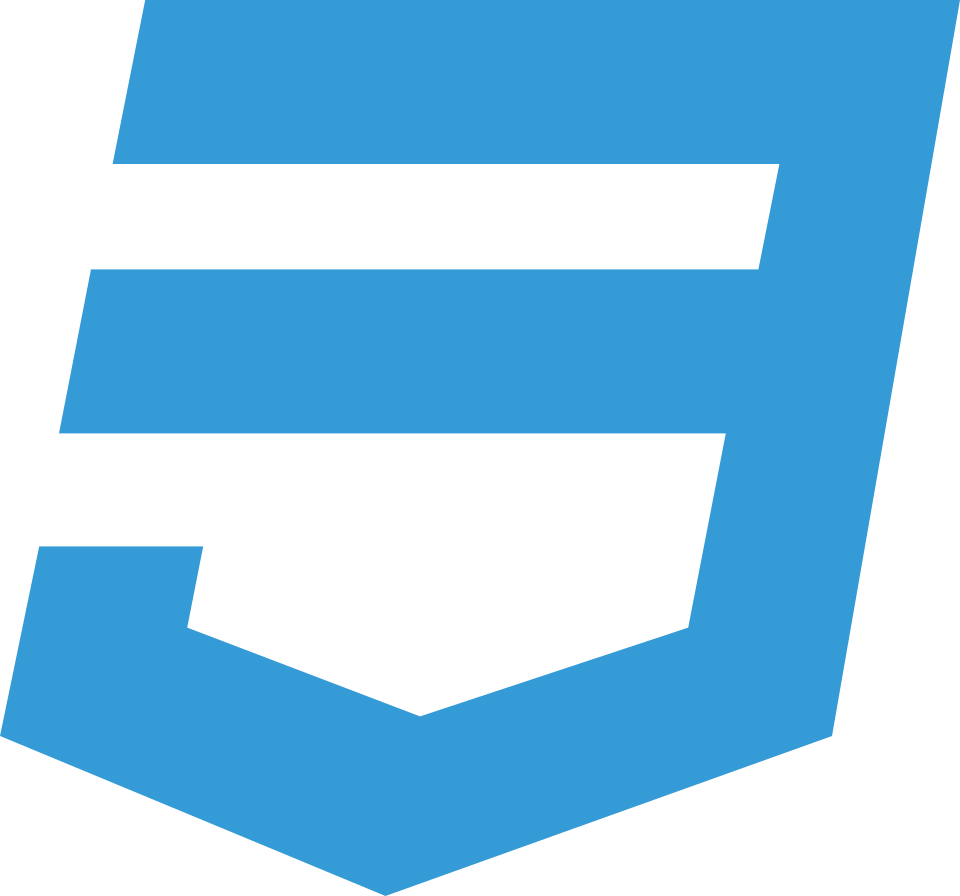

# 👋 Hi, I'm Anoof Abdul Kadar

### BCA Graduate | MCA Student

Indian developer based in Kuwait,
passionate about frontend architecture and clean UI design.
Expanding my backend expertise to complement a frontend-first mindset.

## 🛠️ Core Technologies I Work With

<table style="width: 100%;">
  <thead>
    <tr>
      <th>Category</th>
      <th>Tools and Technologies</th>
    </tr>
  </thead>
  <tbody>
    <tr>
      <td><b>Frontend</b></td>
      <td>
        <code> HTMl</code>
        <code> React</code>
        <code> CSS</code>
        <code> SASS</code>
        <code> Bootstrap</code>
        <code> Fluent Design System</code>
      </td>
    </tr>
    <tr>
      <td><b>Backend</b></td>
      <td>
        <code> NodeJS</code>
        <code> ExpressJS</code></td>
    </tr>
    <tr>
      <td><b>Databases</b></td>
      <td>
        <code> MySQL</code>
        <code> MongoDB</code>
    </td>
    </tr>
    <tr>
      <td><b>Languages</b></td>
      <td>
        <code> JavaScript</code>
        <code> TypeScript</code>
        <code> Java</code>
        <code> Python</code>
        <code> C++</code>
        <code> C</code>
      </td>
    </tr>
    <tr>
      <td><b>Design & UI</b></td>
      <td>
      <code> Figma</code>
      <code> UI/UX Principles</code></td>
    </tr>
  </tbody>
</table>

<!-- | **Tools & Other** | `MS Office`                                                    | -->

<!-- # 📌 Featured Projects -->

## 🌐 Connect With Me

[📫 Email me](mailto:anuabdulkadar@gmail.com) · [💼 LinkedIn](https://www.linkedin.com/in/anu1o)
